- 算法特性
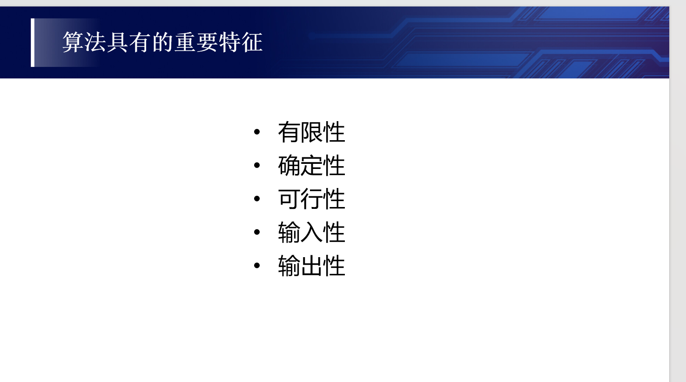
- 主定理
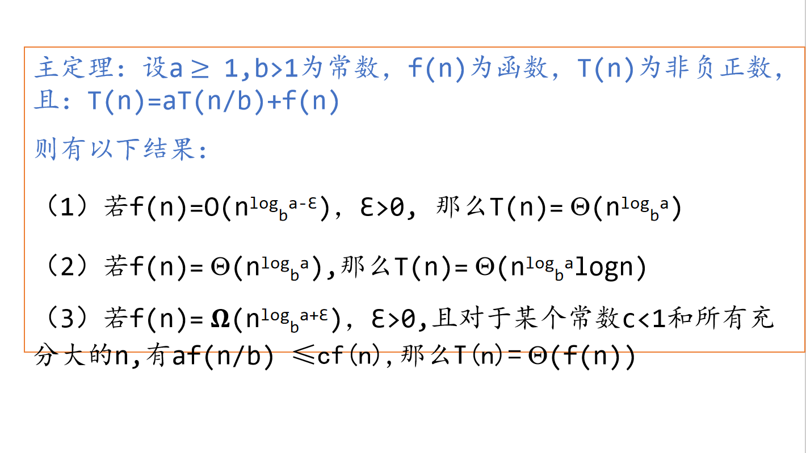
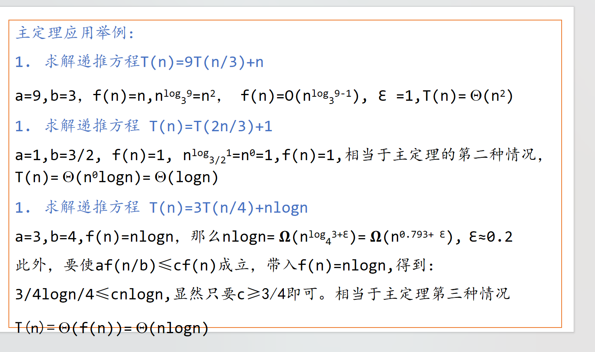
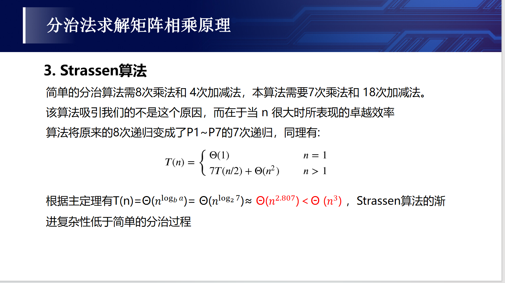
- 空间复杂度
    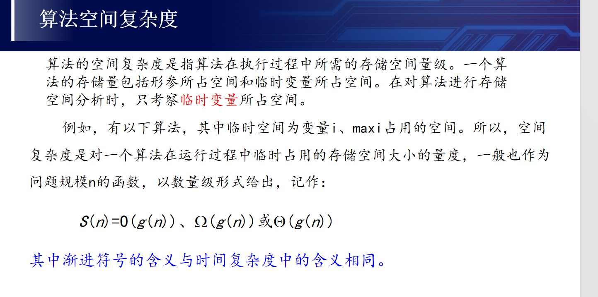
- 递归的条件
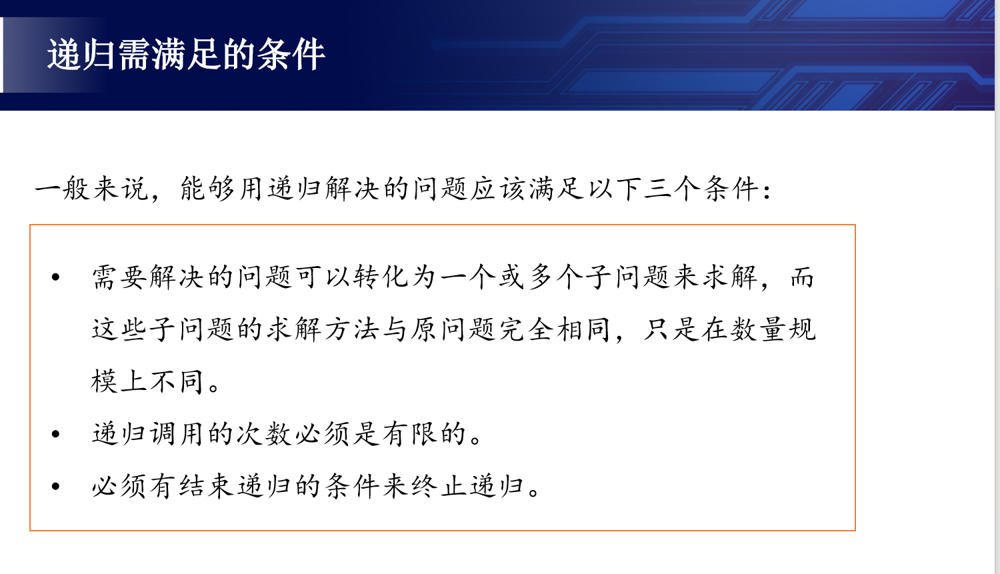
  - 汉诺塔
  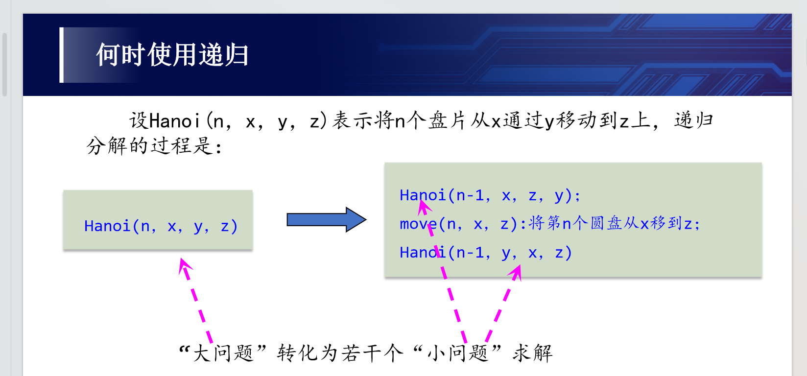
- 递归转非递归
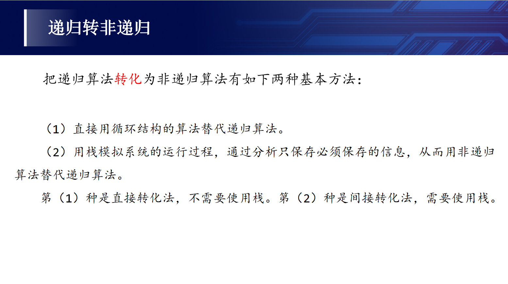
- 快速排序
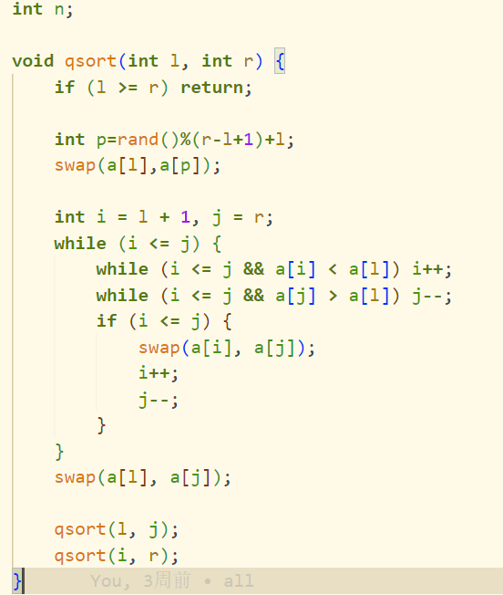
- dp的条件
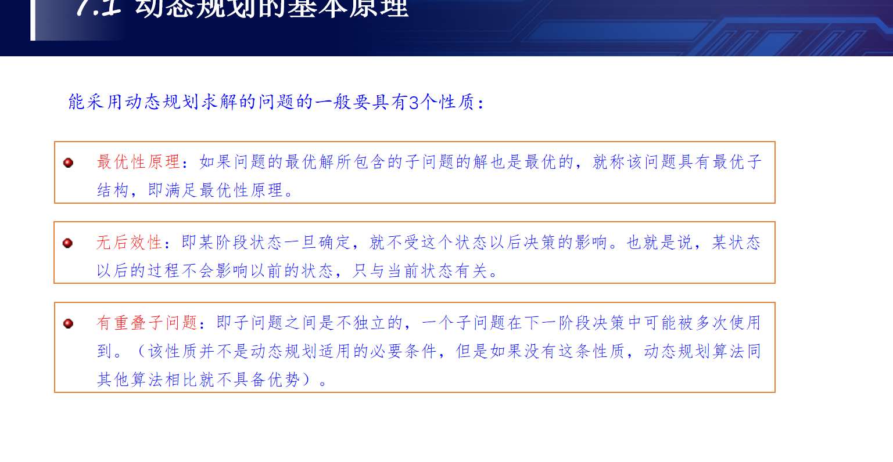
- 问题的解空间
    - 一个复杂问题的解决方案是由若干个小的决策步骤组成的决策序列，解决一个问题的所有可能的决策序列构成该问题的**解空间**。
    - 应用回溯法求解问题时，首先应该明确问题的解空间。解空间中满足约束条件的决策序列称为**可行解**。一般来说，解任何问题都有一个目标，在约束条件下使目标达到最优的可行解称为该问题的**最优解**。
  - 解空间的类型：
    - 当所给的问题是从n个元素的集合S中找出满足某种性质的子集时，相应的解空间树称为**子集树**。
    - 当所给的问题是确定n个元素满足某种性质的排列时，相应的解空间树称为**排列树**。
- 剪枝函数：
  - 用**约束函数**在扩展结点处剪除不满足约束的子树；用**限界函数**剪去得不到问题解或最优解的子树。
- 回溯法的步骤
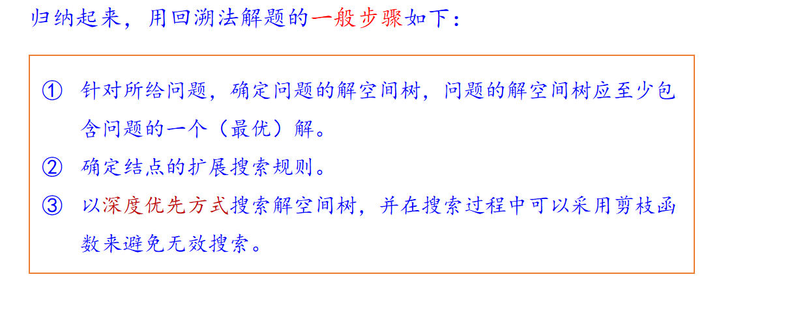 
- A*算法
 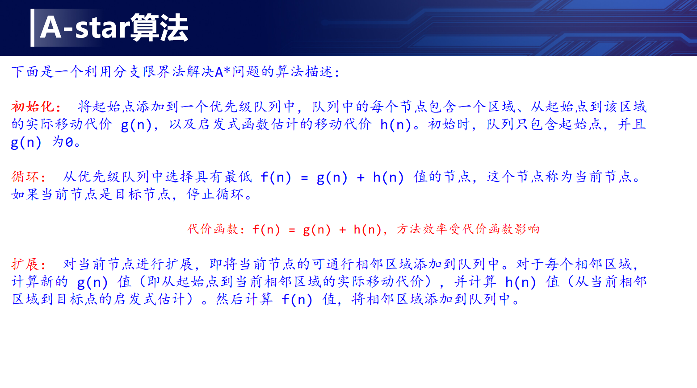
- 贪心算法基本要素：
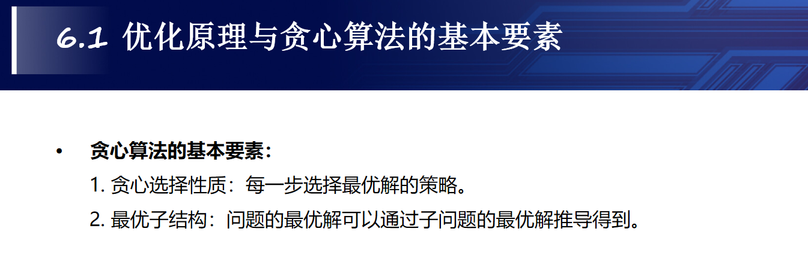
- P问题
  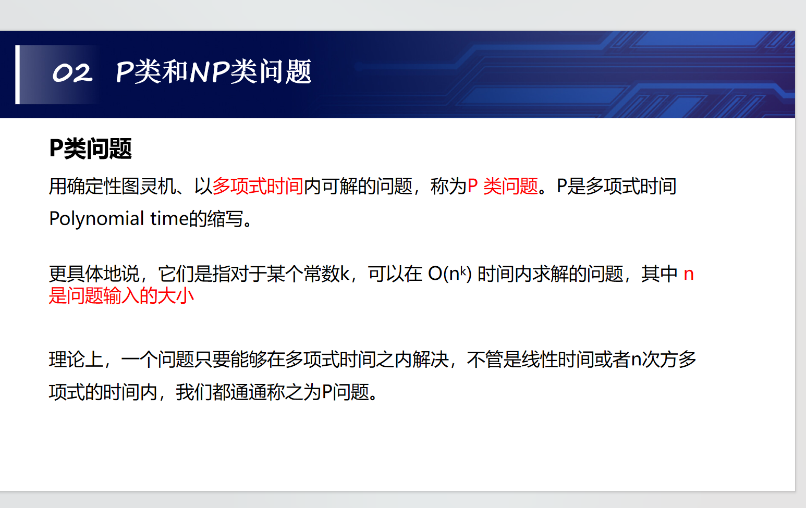
- NP问题
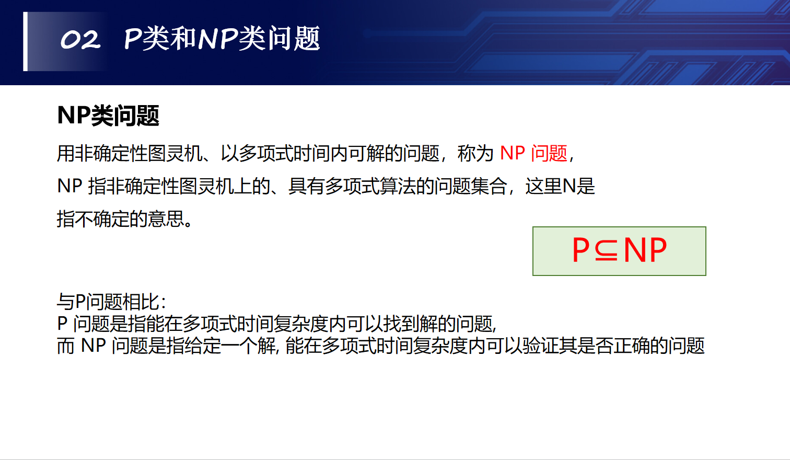
- NPC问题
  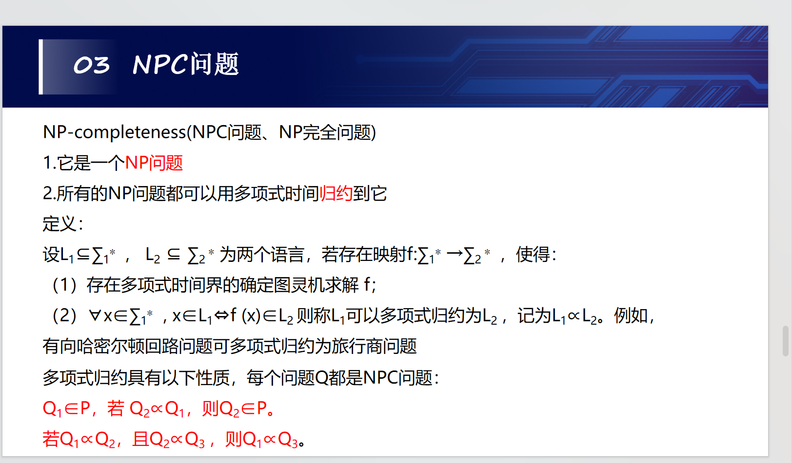
- NP-hard问题
  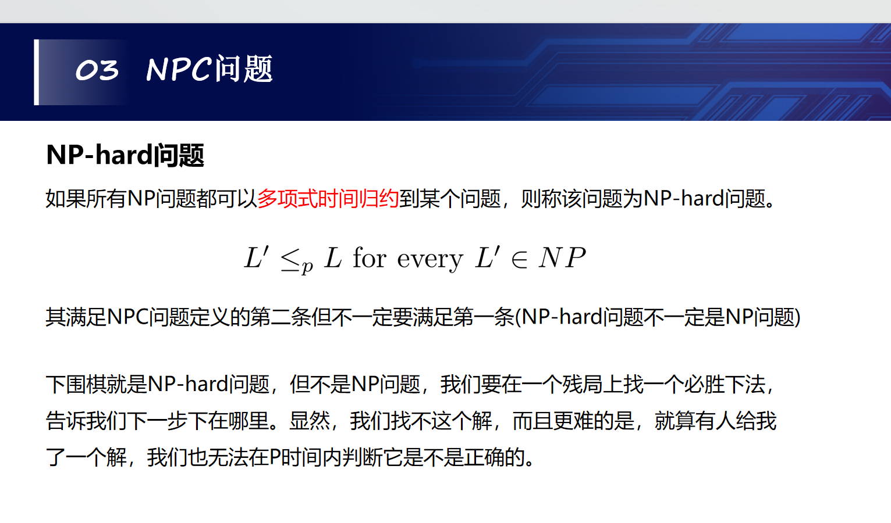