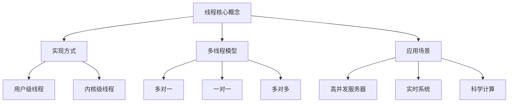

- 这是linux环境下可用的代码版本

```mermaid
graph TD
    A[线程核心概念] --> B[实现方式]
    A --> C[多线程模型]
    B --> D[用户级线程]
    B --> E[内核级线程]
    C --> F[多对一]
    C --> G[一对一]
    C --> H[多对多]
    A --> I[应用场景]
    I --> J[高并发服务器]
    I --> K[实时系统]
    I --> L[科学计算]
```